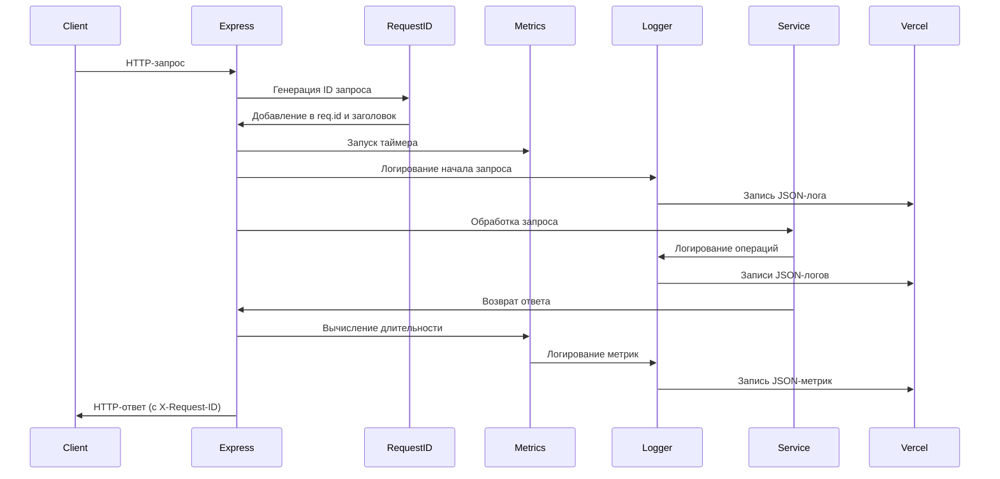

# Пакет Shared

## Использование логгера

### Базовое использование
const logger = createLogger('service-name');
logger.info('Message', { context });

### С контекстом запроса
const requestLogger = createChildLogger(logger, { requestId, userId });

### Уровни логирования
- error: Ошибки, требующие внимания
- warn: Предупреждения
- info: Информационные сообщения (по умолчанию)
- debug: Детальная отладочная информация

### Файлы логов и ротация (не для Vercel)
Включите ротацию JSON-логов в файл с помощью `LOG_TO_FILE=true` (опционально `LOG_FILE_PATH=logs/app.log`). Настройки ротации:
- `LOG_SIZE_MB` (по умолчанию 100)
- `LOG_INTERVAL` (по умолчанию 1d) - принимает 'daily', 'hourly', '1d', '1h' или миллисекунды
- `LOG_MAX_FILES` (по умолчанию 30)
- `LOG_COMPRESS` (true/false) - ⚠️ не поддерживается pino-roll, будет проигнорировано
Vercel использует только вывод JSON в stdout.

### Логирование метрик
logger.info('Operation completed', {
  metric: 'operation_name',
  duration: 123,
  success: true
});

## Диаграмма потока логирования

## Структура логов

| Компонент | Уровень | Контекст | Метрики |
|-----------|---------|----------|---------|
| HTTP-запрос | info | method, path, requestId, userId | duration, statusCode, bodySize |
| Запрос к БД | info | operation, table, requestId | duration, rowCount |
| Telegram API | info | method, chatId, botId | duration, success |
| Webhook | info | botId, userId, updateType | processingTime |
| Ошибка | error | requestId, userId, stack | errorType, errorCode |
